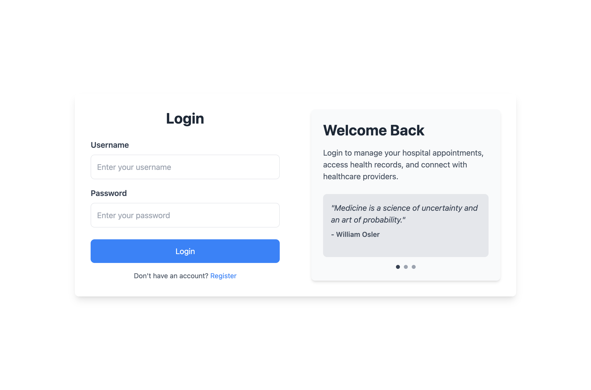
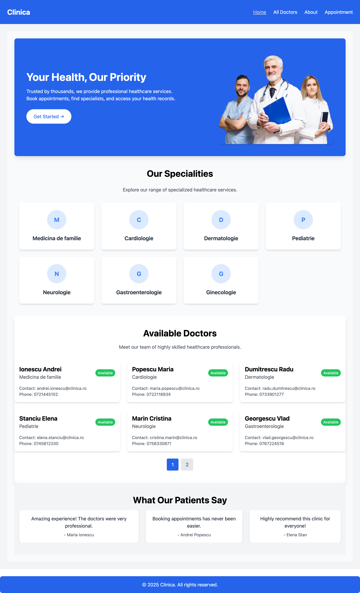
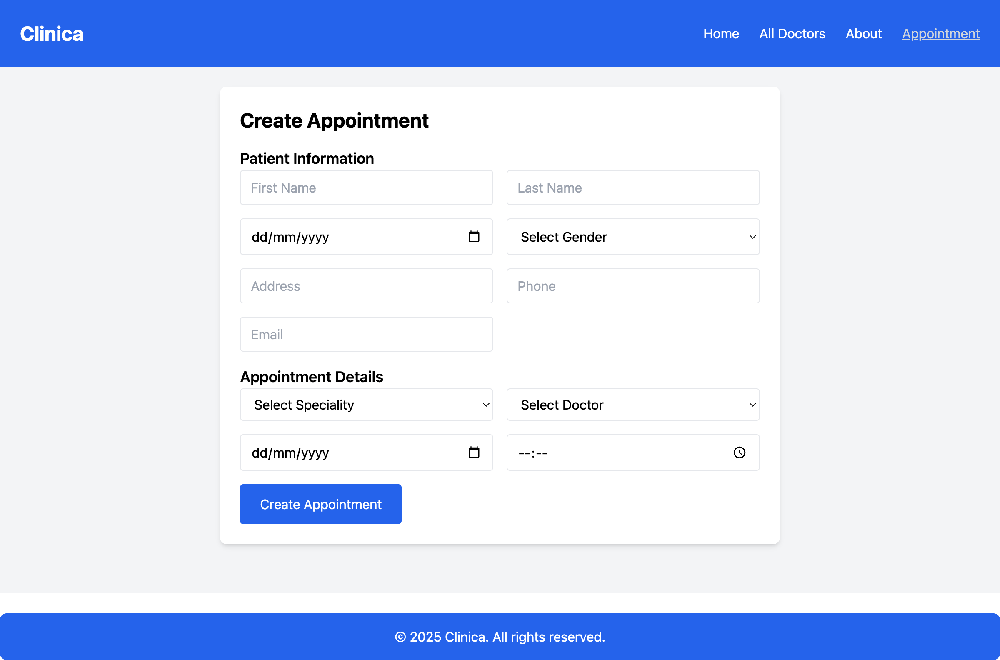
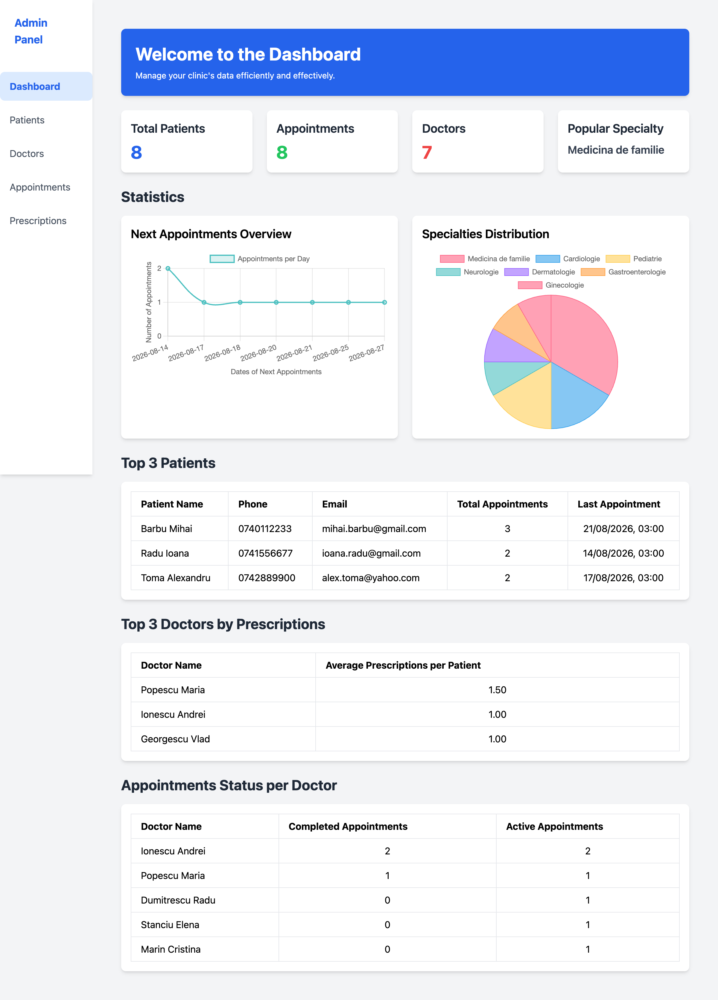
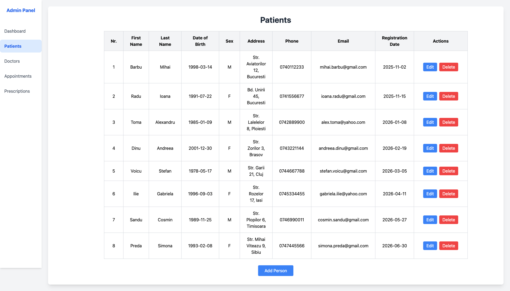
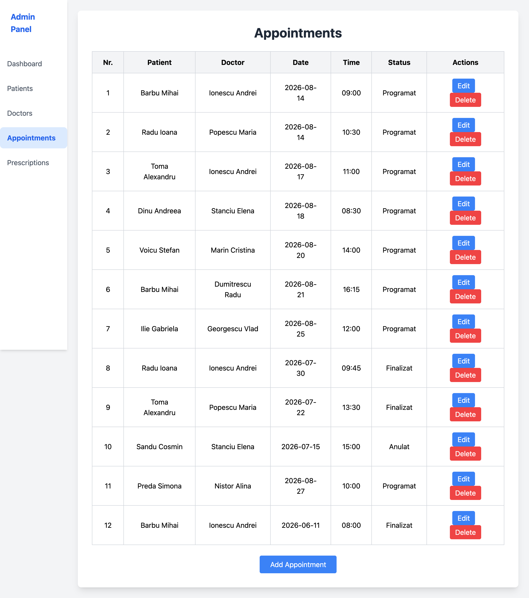

# Doctor Patient Management System

A web application for family doctors' practices: patients, doctors, appointments and
prescriptions are managed from a single admin panel, while patients get a public site where they
can browse specialists and request an appointment.

Built as a university Databases project — a React + Tailwind single-page app on the front,
a Node/Express REST API on the back, and a Microsoft SQL Server database underneath. The
requirements analysis, the table design and the query list are in
[`Definirea Cerințelor...docx`](Definirea%20Cerințelor%20pentru%20Aplicația%20de%20Gestionare%20a%20Pacienților%20pentru%20Medicii%20de%20Familie.docx)
(Romanian).

---

## Screenshots

The screenshots below were taken against a database seeded with sample data.

### Login

Username/password sign-in; the response carries an `admin` flag that decides whether the user
lands on the public site or in the admin panel.



### Public home page

Hero section, the specialities present in the database, a paginated list of doctors and patient
testimonials.



### Book an appointment

One form that creates the patient record and the appointment together: the doctor dropdown is
filtered by the speciality chosen above it.



### Admin dashboard

Key counters, a line chart of the upcoming appointments per day, a pie chart of the speciality
distribution, and three ranking tables computed by SQL aggregate queries.



### Patients

Inline editing directly in the table, plus a modal for adding a new patient.



### Appointments

Appointments joined with patient and doctor names, with the status of each
(`Programat` / `Anulat` / `Finalizat`).



---

## Features

### Public site (`/home`)

- **Home** — specialities derived from the doctors in the database, a paginated doctor list
  (6 per page) and testimonials.
- **All doctors** — the same list with a speciality filter in the sidebar.
- **About** — presentation page for the clinic.
- **Appointment** — a booking form that inserts the patient and then the appointment; the doctor
  dropdown is filtered by the selected speciality.

### Admin panel (`/admin`)

- **Dashboard** — total patients, upcoming appointments, doctor count and the most requested
  speciality; a line chart of the next appointments per day and a pie chart of the speciality
  distribution (Chart.js); tables for the top 3 patients, the top 3 doctors by average
  prescriptions per patient, and completed vs. active appointments per doctor.
- **Patients** — full CRUD, with inline row editing and a modal for adding.
- **Doctors** — full CRUD (name, speciality, phone, e-mail).
- **Appointments** — full CRUD, with patient and doctor selected from dropdowns and a status field.
- **Prescriptions** — full CRUD, each linked to a patient and a doctor.

### Authentication

Registration hashes the password with **bcrypt** (10 rounds) and rejects a username or e-mail
that already exists. Login compares against the hash and returns the user's `admin` flag, which
the client uses to redirect to `/admin` or `/home`.

---

## Tech stack

**Frontend** — React 18 · React Router 6 · Vite 5 · Tailwind CSS 3 · Axios · Chart.js +
react-chartjs-2

**Backend** — Node.js · Express 4 · `mssql` with the `msnodesqlv8` driver · bcryptjs · cors

**Database** — Microsoft SQL Server (SQL Server Express, Windows Authentication)

---

## Architecture

```
React SPA (Vite, :5173)  ──axios──▶  Express REST API (:5000)  ──msnodesqlv8──▶  SQL Server
      │                                                                            (Clinica)
      ├── /            login
      ├── /register    sign-up
      ├── /home/*      public site   (doctors, about, appointment booking)
      └── /admin/*     admin panel   (dashboard, patients, doctors, appointments, prescriptions)
```

The API is a single flat Express file: no ORM, no router modules — every endpoint runs a tagged
template `sql.query` (parameterised, so the values are not concatenated into the SQL text).
Aggregations for the dashboard are done in SQL, not in JavaScript, under `/stats/*`.

---

## Repository layout

```
code/proiect-bd/
├── src/
│   ├── App.jsx                  routing (login, register, /home/*, /admin/*)
│   ├── backend/server.js        the whole Express API + SQL Server connection
│   ├── components/              Sidebar (admin), Header & Footer (public site)
│   ├── pages/
│   │   ├── login/, register/    authentication screens
│   │   ├── home/                Dashboard, Doctors, About, Appointment
│   │   └── admin/               AdminPanel + Dashboard, Pacienti, Medici, Programari, Retete
│   └── assets/                  images and icons
├── public/assets/               images referenced by absolute path (/assets/...)
├── tailwind.config.js, vite.config.js, eslint.config.js
└── package.json                 both the frontend and the API dependencies live here
```

---

## Database

Database name: **`Clinica`**. Tables used by the application:

| Table | Key columns |
|-------|-------------|
| `Users` | `Username`, `Email`, `Password` (bcrypt hash), `admin` (bit) |
| `Pacienti` | `pacient_id` (PK), `nume`, `prenume`, `data_nasterii`, `sex`, `adresa`, `telefon`, `email`, `data_inregistrarii` |
| `Medici` | `medic_id` (PK), `nume`, `prenume`, `specializare`, `telefon`, `email` |
| `Programari` | `programare_id` (PK), `pacient_id` (FK), `medic_id` (FK), `data_programarii`, `ora_programarii`, `status` |
| `Retete` | `reteta_id` (PK), `pacient_id` (FK), `medic_id` (FK), `data_emiterii`, `detalii_reteta` |

`status` takes one of `Programat`, `Anulat`, `Finalizat` — the dashboard's "completed vs. active"
table depends on exactly these values.

The design document also specifies `Consultatii`, `Medicamente` and `Reteta_Medicamente`
(consultations and the prescription–medicine link table). Those are part of the schema but have
no API endpoints or screens yet.

**There is no `.sql` schema script in the repository** — the database has to be created by hand
from the table list above before the API can serve anything.

---

## Setup

### Requirements

- Node.js 18+
- Microsoft SQL Server (Express is enough) **on Windows** — the API connects through
  `msnodesqlv8` with Windows Authentication, which is a Windows-only path.

### 1. Database

Create a database named `Clinica` and the tables listed above. Insert at least one row in `Users`
with `admin = 1` to be able to reach the admin panel (the password column must hold a bcrypt
hash — register through the app and flip the flag afterwards).

### 2. Connection string

`src/backend/server.js` has the server instance hard-coded:

```js
const dbConfig = {
    server: "DESKTOP-Q97K3R2\\SQLEXPRESS",  // change to your own instance
    database: "Clinica",
    driver: "msnodesqlv8",
    options: { trustedConnection: true, encrypt: false, trustServerCertificate: true },
};
```

Change `server` to your machine's SQL Server instance name.

### 3. Install and run

```bash
cd code/proiect-bd
npm install

node src/backend/server.js    # API  → http://localhost:5000
npm run dev                   # SPA  → http://localhost:5173
```

Both have to be running: the API address is hard-coded as `http://localhost:5000` in every page,
so the frontend shows empty lists if the API is down.

---

## API

All endpoints return JSON; there are no auth headers — the API is open once it is running.

| Method | Endpoint | Purpose |
|--------|----------|---------|
| `POST` | `/register` | create a user (409 if the username or e-mail exists) |
| `POST` | `/login` | verify credentials, return the `admin` flag |
| `GET` `POST` `PUT` `DELETE` | `/patients` `/patients/:id` | patient CRUD |
| `GET` `POST` `PUT` `DELETE` | `/doctors` `/doctors/:id` | doctor CRUD |
| `GET` `POST` `PUT` `DELETE` | `/appointments` `/appointments/:id` | appointment CRUD (GET joins patient and doctor names) |
| `GET` `POST` `PUT` `DELETE` | `/prescriptions` `/prescriptions/:id` | prescription CRUD (GET joins patient and doctor names) |
| `GET` | `/stats/total-patients` | patient count |
| `GET` | `/stats/upcoming-appointments` | appointments from today onwards |
| `GET` | `/stats/active-doctors` | doctor count |
| `GET` | `/stats/popular-speciality` | most booked speciality |
| `GET` | `/stats/next-appointments` | next 10 dates with an appointment count each |
| `GET` | `/stats/specialities-distribution` | appointments grouped by speciality |
| `GET` | `/stats/top-patients` | top 3 patients by number of appointments |
| `GET` | `/stats/top-doctors` | top 3 doctors by number of appointments |
| `GET` | `/stats/top-doctors-prescriptions` | top 3 doctors by average prescriptions per patient |
| `GET` | `/stats/doctors-appointments-status` | completed vs. active appointments per doctor |

---

## Limitations

Worth knowing before reading the code — this is a course project, not a production system:

- **No session or token.** After login the client just redirects; `/admin` is reachable by typing
  the URL, and the API itself never checks who is calling.
- **The SQL Server host is hard-coded**, as is `http://localhost:5000` in every page that calls
  the API.
- **Windows only**, because of the `msnodesqlv8` + Windows Authentication combination.
- **Consultations and medicines** are designed in the requirements document but not implemented.
- The booking form creates a **new patient record on every submission**, even for someone who is
  already registered.
